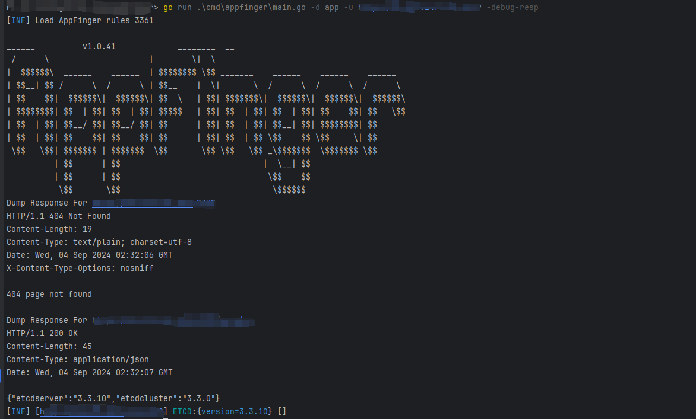

# AppFinger - Web Application Fingerprint Scanner

AppFinger is an open-source web application fingerprint scanner designed to identify and analyze web applications based on their unique characteristics.

## Usage

    Flags:
    APPFINGER:
    -l, -url-file string     File containing urls to scan
    -u, -url string[]        target url to scan (-u INPUT1 -u INPUT2)
    -t, -threads int         Number of concurrent threads (default 10) (default 10)
    -timeout int             Timeout in seconds (default 10) (default 10)
    -x, -proxy string        HTTP proxy to use for requests (e.g. http://127.0.0.1:7890)
    -s, -stdin               Read urls from stdin
    -d, -finger-home string  finger yaml directory home default is built-in
    
    HELP:
    -debug  debug
    
    OUTPUT:
    -o, -output string  file to write output to

## Example
    appfinger -u https://example.com

## How it Works

AppFinger scans web applications by analyzing their unique fingerprints, providing valuable insights into the technologies used.

- Deep Detection Comparison


*Figure: Comparison of standard detection vs deep detection*


## Contributing
Feel free to contribute to AppFinger by opening issues or submitting pull requests on GitHub.

## License
AppFinger is licensed under the MIT License. See the LICENSE file for details.


## Todo
```
magmi 11
online_fire_reporting_system 11
xstream 10
caucho_resin 4
mautic 3
qloapps 3
casaos 3
eventon 3
gnuboard 3
servicenow 3
jeesns 3
octobercms 3
trixbox 3
sysaid 3
cobbler 3
microstrategy_web 3
loganalyzer 3
spring_cloud_config 3
linear_emerge_essential_firmware 3
tos 3
unified_threat_management 3
hyperflex_hx_data_platform 3
wsr_2533dhpl2_bk_firmware 3
h8922 3
manageengine_adselfservice_plus 3
identity_manager 3
collaboration 3
sv_cpt_mc310_firmware 3
school_dormitory_management_system 3
emerge_e3_firmware 3
complete_online_job_search_system 3
i3geo 3
moosocial 3
ioffice 3
resourcespace 2
imgproxy 2
mosparo 2
redash 2
kavita 2
eprints 2
weblogic 2
spring_cloud_netflix 2
big_ip 2
prtg_network_monitor 2
dell 2
opnsense 2
internet_information_server 2
system_management_homepage 2
firewall_analyzer 2
xsuite 2
php_mailer 2
netweaver 2
dgn2200 2
netweaver_application_server_java 2
contact_form 2
adaptive_security_appliance_software 2
dwr_116_firmware 2
nas_os 2
responsive_filemanager 2
lgate_902_firmware 2
webpanel 2
uag2100_firmware 2
t24 2
dns_320_firmware 2
business_intelligence_publisher 2
photo_station 2
keycloak 2
drag_and_drop_multiple_file_upload___contact_form_7 2
jira_data_center 2
salt 2
qcubed 2
firepower_threat_defense 2
quiz_and_survey_master 2
xenmobile_server 2
tutor_lms 2
vigorconnect 2
workspace_one_uem_console 2
the_plus_addons_for_elementor 2
jannah 2
transposh_wordpress_translation 2
web_server 2
voipmonitor 2
bf_430_firmware 2
raspap 2
civic_platform 2
thruk 2
jeecg 2
shenyu 2
e1_zoom_firmware 2
aviatrix_controller 2
testrail 2
ecs_router_controller_ecs_firmware 2
online_shopping_system_advanced 2
fms 2
online_event_booking_and_reservation_system 2
manageengine_desktop_central 2
thinfinity_virtualui 2
genieacs 2
ditty 2
avada 2
drawio 2
e_business_suite 2
bigant_server 2
casdoor 2
dairy_farm_shop_management_system 2
backupbuddy 2
manageengine_access_manager_plus 2
laravel_filemanager 2
welcart_e_commerce 2
bank_locker_management_system 2
stagil_navigation 2
papercut_mf 2
faculty_evaluation_system 2
endpoint_manager_mobile 2
icewarp 2
moostore 2
flir 2
bems 2
oracle_ebs 2
rg_ew1200g 2
klr300n 2
geowebserver 2
zms 2
httpbin 2
openbmcs 2
tasmota 2
etcd 2
dbgate 2
froxlor 2
tamronos_iptv 2
qihang_media 2
tiki_wiki 2
woodwing_studio_server 2
global_domains 2
hasura_graphql 2
dropbear_ssh 2
vmware_cloud_director 2
orange_forum 1
ilias 1
guacamole 1
appsmith 1
lychee 1
rosariosis 1
webtrees 1
squidex 1
blog 1
admidio 1
appwrite 1
bagisto 1
erxes 1
unraid 1
exim 1
kodi 1
gitblit 1
chevereto 1
bludit 1
suitecrm 1
oxid_eshop 1
ampache 1
teslamate 1
teampass 1
cloudron 1
otobo 1
traggo 1
nocodb 1
keystonejs 1
wampserver 1
ansible 1
crystal 1
vite.js 1
yui 1
cognito 1
arc 1
cachet 1
combodo_itop 1
divido 1
essential_addons_for_elementor 1
givewp 1
jive 1
mkdocs 1
pagekit 1
phoenix 1
reveal.js 1
rubedo 1
seomatic 1
siteminder 1
transcend 1
total.js 1
深信服应用交付报表系统 1
struts2 1
codoforum 1
portainer 1
uwsgi 1
网康ns_asg安全网关 1
das_usm 1
sangfor应用交付管理系统 1
axel 1
magicflow 1
汉塔科技上网行为管理系统 1
webctrl 1
supervisor 1
eyesofnetwork 1
nuxeo 1
fusionauth 1
lokomedia 1
rethinkdb 1
imcat 1
cadvisor 1
h3csecpath运维审计系统 1
ewebs 1
thinkadmin 1
eyou_mail 1
livebos 1
lionwiki 1
kingdee_eas 1
phpwiki 1
mpsec 1
emlog 1
zte_router 1
blackboard 1
huawei_router 1
nagios 1
storm 1
phpok 1
tpshop 1
siteengine 1
kindeditor 1
cassandra 1
open_edx 1
tianqing 1
apache_ambari 1
manageengine_opmanager 1
barracuda_ssl_vpn 1
zxoa 1
ruijie_rg_uac 1
dvg_n5402sp 1
azkaban_web_client 1
skywalking 1
oss 1
openam 1
ruoyi 1
amcrest_camera 1
mesos 1
oa8000 1
loytec 1
motioneye 1
oneinstack 1
youphptube_encoder 1
jfrog 1
nifi 1
ruijie_smart_web 1
xiuno 1
netis 1
liferay_portal 1
untangle 1
multilaser 1
alfresco 1
jamf_pro 1
rumpus 1
alienvault 1
propack 1
openbb 1
cofax 1
rainbow.zen 1
rsfiles 1
xwork 1
com_imagebrowser 1
com_extplorer 1
com_ionfiles 1
rwcards 1
pro_desk_support_center 1
nweb2fax 1
wvc54gca 1
kr_php_web_content_server 1
com_if_nexus 1
webglimpse 1
com_ccnewsletter 1
jw_allvideos 1
scriptegrator_plugin 1
com_jvideodirect 1
com_jashowcase 1
com_jcollection 1
com_gcalendar 1
com_cartweberp 1
com_abbrev 1
com_rokdownloads 1
com_communitypolls 1
je_form_creator 1
com_janews 1
com_dwgraphs 1
com_userstatus 1
com_jinventory 1
com_joomlapicasa2 1
com_joomlaupdater 1
com_svmap 1
com_news_portal 1
com_sebercart 1
com_hsconfig 1
com_weberpcustomer 1
com_jresearch 1
com_ckforms 1
com_jukebox 1
com_loginbox 1
com_vjdeo 1
com_photobattle 1
com_jprojectmanager 1
com_webtv 1
com_addressbook 1
com_horoscope 1
com_advertising 1
com_sweetykeeper 1
com_preventive 1
com_alphauserpoints 1
com_jfeedback 1
com_mmsblog 1
com_awdwall 1
com_matamko 1
com_redshop 1
com_powermail 1
com_tweetla 1
com_shoutbox 1
com_travelbook 1
com_myblog 1
com_jacomment 1
com_zimbcomment 1
com_zimbcore 1
com_wmi 1
com_graphics 1
com_smartsite 1
com_noticeboard 1
com_ultimateportfolio 1
com_arcadegames 1
com_onlineexam 1
if_surfalert 1
com_archeryscores 1
com_mtfireeagle 1
com_market 1
com_drawroot 1
com_smestorage 1
com_properties 1
com_orgchart 1
com_beeheard 1
com_multimap 1
com_multiroot 1
com_blogfactory 1
com_gadgetfactory 1
com_lovefactory 1
com_jwhmcs 1
com_datafeeds 1
com_joomlaflickr 1
fabrik 1
com_javoice 1
com_redtwitter 1
com_perchacategoriestree 1
com_perchaimageattach 1
com_perchagallery 1
com_perchafieldsattach 1
com_perchadownloadsattach 1
com_dioneformwizard 1
com_mscomment 1
com_simpledownload 1
com_jequoteform 1
com_bfsurvey_profree 1
surfboard_sbv6120e 1
com_picasa2gallery 1
com_jesectionfinder 1
com_realtyna 1
com_music 1
com_joomla_visites 1
com_foobla_suggestions 1
com_picsell 1
com_jphone 1
cmnc_200_firmware 1
com_jotloader 1
com_jradio 1
com_jimtawl 1
com_canteen 1
com_jejob 1
modx_revolution 1
majordomo_2 1
unified_ip_interactive_voice_response 1
com_obsuggest 1
orchard 1
phpshowtime 1
11in1 1
websitepanel 1
flatnux 1
counteract 1
telaen 1
unified_communications_manager 1
xibo 1
domphp 1
simatic_s7_cpu_1200_firmware 1
n150_f9k1009_firmware 1
blackarmor_nas_220_firmware 1
bash 1
http_file_server 1
osclass 1
soplanning 1
p.dga4001n_firmware 1
drutt_mobile_service_delivery_platform 1
virtual_system_administrator 1
web_console 1
bonita_bpm_portal 1
helpdesk_pro 1
novius_os 1
geddy 1
nordex_control_2_scada 1
tivoli_common_reporting 1
manageengine_firewall_analyzer 1
robotcpa 1
dispatcher 1
tooltip_glossary 1
zedna_ebook_download 1
scoreme 1
wnap320_firmware 1
spring_security_oauth 1
webnms_framework 1
threat_discovery_appliance 1
snc_series_firmware 1
airwave 1
jqueryfiletree 1
primefaces 1
dt80_dex_firmware 1
servicedesk 1
integrated_lights_out_4_firmware 1
documentum_administrator 1
bouqueteditor 1
restler 1
routerfiberhome_firmware 1
ulterius_server 1
custom_search 1
graphite 1
applications_framework 1
network_data_loss_prevention 1
r6200_firmware 1
caseaware 1
active_management_technology_firmware 1
ds_2cd2032_i_firmware 1
dh_ipc_hdbw23a0rn_zs_firmware 1
ipm_721s_firmware 1
telerik_reporting 1
oauth 1
phpunit 1
webarchive_agent 1
420hd_ip_phone_firmware 1
vspace_pro 1
zend_server 1
gpon_router_firmware 1
orchid_core_vms 1
tomcat_jk_connector 1
intelligent_power_manager 1
schools_alert_management_script 1
emc_idrac7 1
h.264_poe_ip_camera_firmware 1
spring_data_commons 1
tika 1
zeta_producer 1
velotismart_wifi_firmware 1
intellect_core_banking 1
ipecs_nms 1
central_wifimanager 1
wirelesshart_fieldgate_swg70_firmware 1
cybrohttpserver 1
bibliopac 1
gift_vouchers 1
logontracer 1
wechat_brodcast 1
ncbi_toolbox 1
eventum 1
my_cloud_wdbctl0020hwt_firmware 1
jck_editor 1
unified_threat_management_firewall 1
planon 1
jasperreports_library 1
streaming_engine 1
database_performance_analyzer 1
secure_global_desktop 1
php_proxy 1
tarantella_enterprise 1
sahi_pro 1
roxy_fileman 1
internet_graphics_server 1
application_management_pack 1
node_srv 1
cloudforms 1
jtag_members_directory 1
printmonitor 1
next 1
couch 1
appweb 1
dvms_workstation 1
checkweigher_prismaweb 1
avatar_uploader 1
tbk_dvr4216_firmware 1
timesheet_next_gen 1
gestionnaire_libre_de_parc_informatique 1
build_metrics 1
nimble_streamer 1
pcoweb_card_firmware 1
pulse_connect_secure 1
yuzo 1
maconomy 1
web_port 1
natemail 1
flightpath 1
lansweeper 1
jaxer 1
instagram_php_api 1
open_school 1
gallery_photoblocks 1
diris_a_40_firmware 1
wordpress_download_manager 1
piluscart 1
nostromo_nhttpd 1
fr6_firmware 1
rv320_firmware 1
yachtcontrol 1
dynamic_resource_scheduling 1
dir_868l_b1_firmware 1
jiangnan_online_judge 1
evolved_programmable_network_manager 1
millet_router_3g_firmware 1
domos 1
at_gs950 1
microstrategy_library 1
hero_maps_premium 1
sg200_50_firmware 1
a3002ru_firmware 1
phpmychat_plus 1
nvms_1000_firmware 1
neon 1
employee_records_system 1
citybook 1
agile_plm 1
communications_diameter_signaling_router 1
bi_publisher 1
am_100_firmware 1
pypiserver 1
webaccess 1
enterprise 1
wip3bvaf_firmware 1
sma_100_firmware 1
wavemarker_studio 1
ccu3_firmware 1
je_messenger 1
atp200_firmware 1
sql_server 1
orion_platform 1
wn530hg4_firmware 1
chop_slider 1
superwebmailer 1
docker_kong 1
micollab 1
operation_bridge_manager 1
application_performance_management 1
translate_wordpress_with_gtranslate 1
cocoon 1
wn530h4_firmware 1
tx_nr585_firmware 1
wn575a4_firmware 1
submitty 1
python_example 1
extreme_management_center 1
paypal_pro 1
nedi 1
business_intelligence 1
biostar_2 1
traefik 1
application 1
tileservergl 1
core 1
eframework 1
unified_ip_conference_station_7937g_firmware 1
sharepoint_enterprise_server 1
nova_lite 1
slc_130_firmware 1
web_proxy 1
z_blogphp 1
gridx 1
gitlab_hook 1
hotel_and_lodge_booking_management_system 1
gmapfp 1
import_xml_and_rss_feeds 1
find 1
nexusdb 1
dsl2888a_firmware 1
cute_editor 1
dcs_2530l_firmware 1
openserver 1
commcell 1
alerta 1
productcomments 1
jgs516pe_firmware 1
jd_edwards_enterpriseone_tools 1
akkadian_provisioning_manager 1
good_learning_management_system 1
ac2100_firmware 1
shoretel_firmware 1
monitorr 1
multi_restaurant_table_reservation_system 1
usg20_vpn_firmware 1
wireless_multiplex_terminal_playout_server 1
opentsdb 1
advanced_comment_system 1
re6500_firmware 1
klog_server 1
gateone 1
simple_board_job 1
twitter_server 1
cse_bookstore 1
smartstorenet 1
15zine 1
maximo_asset_management 1
canvas_learning_management_service 1
clink_office 1
solution_manager 1
businessobjects_business_intelligence_platform 1
mojarra 1
ultimate_faq 1
smart_update_manager 1
linuxki 1
epolicy_orchestrator 1
puppet_enterprise 1
vigor2960_firmware 1
lotus_core_cms 1
infinitewp_client 1
sharefile_storagezones_controller 1
jeedom 1
exacqvision_enterprise_manager 1
iplanet_web_server 1
subversion_application_lifecycle_management 1
sonicos 1
sma_200_firmware 1
gryphon_tower_firmware 1
rax43_firmware 1
spring_boot_actuator_logview 1
systeminformation 1
scimono 1
mf971r_firmware 1
dir_3040_firmware 1
premierwave_2050_firmware 1
view_planner 1
operation_bridge_reporter 1
evlink_city_evc1s22p4_firmware 1
mercury_x18g_firmware 1
advanced_order_export 1
openid_connect_generic_client 1
accessally 1
patreon_wordpress 1
goto 1
findeo 1
stop_spammers 1
ultimate_maps 1
redirection_for_contact_form_7 1
kaswara 1
simple_giveaways 1
mediumish 1
bello 1
jnews 1
fancy_product_designer 1
real_estate_7 1
foodbakery 1
kentharadio 1
calendar_event_multi_view 1
workreap 1
paytm_pay 1
podlove_podcast_publisher 1
registrationmagic 1
secure_copy_content_protection_and_content_locking 1
noptin 1
smash_balloon_social_post_feed 1
english_wordpress_admin 1
easy_social_feed 1
huemagic 1
aurall_rec_monitor 1
report2web 1
jenzabar 1
meet 1
agcombo_vd625_firmware 1
datepicker_calendar 1
device_management 1
infinity 1
appspace 1
tapestry 1
lumis_experience_platform 1
chronoforums 1
netmask 1
wireless_n_wifi_repeater_firmware 1
edgeline_infrastructure_manager 1
php_curl_class 1
sidekiq 1
win_300_firmware 1
lanproxy 1
knowage 1
ignition 1
sis_rewe_go 1
ova_appliance 1
appliance_base_software 1
vantara_pentaho 1
ac11_firmware 1
meshery 1
gt_ac2900_firmware 1
maian_cart 1
node_red_dashboard 1
flask_security 1
squirrelly 1
express_handlebars 1
nbg2105_firmware 1
ipc_hum7xxx_firmware 1
ruckus_iot_controller 1
g_cam_ebc_2110 1
shiny_server 1
ansi_up 1
gespage 1
faust_iserver 1
serv_u 1
ip_audtio_gateway_firmware 1
termtalk_server 1
am 1
access_manager 1
halo_camera 1
viaware 1
sureline 1
workforce_optimization 1
nova 1
xn8024r_firmware 1
smartblog 1
tiny_java_web_server 1
cobranca 1
phpfastcache 1
azure_automation_state_configuration 1
netgenie_c0101b1_20141120_ng11vo_firmware 1
cliniccases 1
true_ranker 1
zoomsounds 1
fv_flowplayer_video_player 1
biqsdrive 1
ind780_firmware 1
comfortel_3600_ip_firmware 1
compact_5500r_firmware 1
galera_webtemplate 1
micro_community 1
justwriting 1
sas\/intrnet 1
placeos_authentication 1
i_panel_administration_system 1
knowledge_warehouse 1
dvr_vx16_firmware 1
konga 1
experience_platform 1
billquick_web_suite 1
netbiblio 1
central_authentication_service 1
ex1200t_firmware 1
alquist 1
clustering 1
simple_client_management_system 1
barcode 1
manageengine_servicedesk_plus 1
sentinel 1
endpoint_manager_cloud_services_appliance 1
hd_network_real_time_monitoring_system 1
ligeo_basics 1
dap_1620_firmware 1
colibri_firmware 1
sdt_cs3b1_firmware 1
permalink_manager_lite 1
mappress 1
spidercalendar 1
wordpress_email_template_designer 1
ad_inserter_pro 1
usg40_firmware 1
page_view_count 1
masterstudy_lms 1
formcraft3 1
alltube 1
infographic_maker 1
title_experiments_free 1
daily_prayer_time 1
kivicare 1
spirit 1
block_and_stop_bad_bots 1
sfos 1
rsvp_and_event_management 1
gwyn\'s_imagemap_selector 1
videos_sync_pdf 1
metform_elementor_contact_form_builder 1
terraboard 1
armember 1
copyright_proof 1
shortcodes_and_extra_features_for_phlox_theme 1
contact_form_7_captcha 1
content_server 1
shardingsphere_elasticjob_ui 1
ap_pagebuilder 1
trilium 1
spring_cloud_gateway 1
spring_cloud_function 1
sinema_remote_connect_server 1
hd_md4x2_4k_e_firmware 1
intouch_access_anywhere 1
oidc_op 1
dogtagpki 1
smartertrack 1
garage_management_system 1
icinga_web_2 1
jai_ext 1
flyte_console 1
piano_led_visualizer 1
terramaster_operating_system 1
a950rg_firmware 1
12_player 1
securitygateway 1
anti_malware_security_and_brute_force_firewall 1
questions_for_confluence 1
control_room_management_suite 1
oas_platform 1
microfinance_management_system 1
college_management_system 1
event_management_system 1
adaudit_plus 1
wordpress_country_selector 1
e_diary_management_system 1
online_birth_certificate_system 1
directory_management_system 1
cyber_cafe_management_system 1
sila_firmware 1
ejs 1
ssl312_firmware 1
usg_flex_100w_firmware 1
roxy_wi 1
haraj 1
nex_forms 1
pfblockerng 1
wn579x3_firmware 1
msnswitch_firmware 1
basic_pdu_firmware 1
wn533a8_firmware 1
spacelogic_c_bus_home_controller_firmware 1
wapples 1
ssl_vpn 1
profilegrid 1
hwl_2511_ss_firmware 1
omnia_mpx_node_firmware 1
go_ibax 1
academy_learning_management_system 1
zaver 1
dapr_dashboard 1
free5gc 1
flat_pm 1
mobile 1
group_export 1
syncserver_s650_firmware 1
simple_task_managing_system 1
kfm 1
joomsport 1
autooptimize 1
user_post_gallery 1
w15e_firmware 1
reqlogic 1
11n_firmware 1
show_all_comments 1
wordpress_events_calendar_plugin 1
pdf_generator_for_wordpress 1
vantara_pentaho_business_analytics_server 1
kubeview 1
helmet_store_showroom_site 1
helmet_store_showroom 1
linear_emerge_e3_access_control_firmware 1
bangresto 1
smartoffice 1
aspera_faspex 1
wl_wn530h4_firmware 1
sma1000_firmware 1
membership_database 1
online_security_guards_hiring_system 1
slimstat_analytics 1
goanywhere_managed_file_transfer 1
watu_quiz 1
bumsys 1
web_appliance 1
compact_controller_100_firmware 1
aria_operations_for_logs 1
kubeoperator 1
art_gallery_management_system 1
obsidian 1
sharefile_storage_zones_controller 1
phpipam 1
appium_desktop 1
ruckus_wireless_admin 1
cxtpc_firmware 1
jms_blog 1
readtomyshoe 1
weaver_office_automation 1
connections_reloaded 1
ethos_identity 1
energy_communication_unit_firmware 1
manageengine_admanager_plus 1
spreadsheet_reader 1
x5000r_firmware 1
leocustomajax 1
rudder_server 1
repetier_server 1
old_age_home_management_system 1
masteriyo 1
jeecg_p3_biz_chat 1
enrollment_system 1
fuxa 1
moveit_cloud 1
control_panel 1
experience_commerce 1
lightdash 1
cloudpanel 1
codekop 1
moveit_transfer 1
pm43_firmware 1
simple_online_piggery_management_system 1
mirth_connect 1
smart_parking_management 1
ip_he950e_firmware 1
filemage 1
webui_aria2 1
webclient 1
fieldpopupnewsletter 1
simpleimportproduct 1
deep_castle_g2 1
availability_booking_calendar 1
bus_reservation_system 1
shuttle_booking_software 1
service_booking_script 1
night_club_booking_software 1
cleaning_business_software 1
taxi_booking_script 1
php_forum_script 1
realgimm 1
adlisting 1
ur5x_firmware 1
ecommerce_cms 1
papercut_ng 1
vitogate_300_firmware 1
playtube 1
d_view_8 1
kafka_connect 1
data_protector 1
muhttpd 1
glibc 1
phonepe 1
aria_operations_for_networks 1
aurora 1
payment_gateway 1
sysaid_on_premises 1
realtek_jungle_sdk 1
jobmonster 1
magnusbilling 1
open_xchange_appsuite 1
antsword 1
fatpipeinc 1
jexboss 1
hems 1
asanhamayesh_cms 1
blue_ocean_excellence 1
cacti_weathermap 1
comai_ras 1
crawlab 1
cvm 1
汇文书目检索系统 1
m2035dn 1
wavlink 1
mssql 1
openmage 1
carrental 1
csz_cms 1
ont1gew_gpon 1
turbocrm 1
yibao_oa 1
stackposts 1
wac124 1
kingsoft_vgm 1
tidb 1
oembed 1
booked 1
xerox 1
webigniter 1
slims 1
shoowbiz 1
rentequip 1
pollbot 1
opencti 1
nginxwebui 1
mirai 1
Jreport 1
webuzo 1
phpgedview 1
mcloud 1
imprivata 1
geniusocean 1
zeppelin 1
fastvue 1
mobiproxy 1
locust 1
esphome 1
espeasy 1
phinx 1
behat 1
yishaadmin 1
beego_admin_dashboard 1
ctp18 1
temporal 1
akeeba 1
vironeer 1
impala 1
commax 1
microstrategy 1
dozzle 1
selenium 1
questdb 1
pmm 1
interlib 1
sar2html 1
siterecovery 1
hrsale 1
xweb500 1
easyimage 1
yunanbao 1
businesso 1
orangescrum 1
gloo 1
erensoft 1
promtail 1
webpagetest 1
surrealtodo 1
fatpipe 1
videoxpert 1
tiny 1
kubecost 1
minimouse 1
kedacom 1
code42 1
browserless 1
nsq 1
doorgets 1
cube 1
maccmsv10 1
permissions 1
sumowebtools 1
ecsimagingpacs 1
cluster 1
kafdrop 1
eris 1
dicoogle 1
javamelody 1
qvidium 1
binom 1
opencpu 1
eos 1
searchreplacedb2 1
taiwanese 1
circarlife 1
dss 1
webasyst 1
webui 1
phpmemcachedadmin 1
alma 1
j2ee 1
vpms 1
infoprint 1
appveyor 1
lmszai 1
maltrail 1
iotawatt 1
indegy 1
atom 1
mobsf 1
parameters 1
esafenet 1
jeewms 1
easyscripts 1
employee 1
wowcms 1
webcalendar 1
etouch 1
groomify 1
facturascripts 1
bravia 1
php_debug_bar 1
kubernetes_web_view 1
azure_pipelines 1
symfony_profiler 1
unifi_wizard 1
epp_server 1
kingdee_v8 1
ampache_music 1
eaa_application_access_system 1
azure_resource_manager 1
solar_log 1
vanguard_post 1
symantec_sepm 1
bscw_server 1
kubernetes_pods_api 1
jboss_jbpm 1
carel_bacnet_gateway 1
magic_r300_2100m_firmware 1
auth_json 1
ace_admin 1
universal_media 1
websphere_portal 1
iot_vdme_simulator 1
wapples_firewall 1
kiwi_tcms 1
ruckus_unleashed 1
commax_biometric_access_control_system 1
digital_rebar 1
sponip_network_system 1
laravel_horizon 1
hanming_video 1
news_script 1
wheilton_e_vpn 1
reddittop_rss 1
eyelock_nano 1
indonasia_toko_cms 1
mida_eframework 1
on_premises_installation 1
ldap_account_manager 1
axyom_network_manager 1
vtiger_crm 1
onlinefarm_management 1
sangfor_cphp 1
wiren_board_webui 1
eclipse_help_system 1
office_webapps 1
synway_smg 1
i_media_server 1
comtrend_adsl 1
servicenow_helpdesk 1
akamai_arl 1
turbo_website_reviewer 1
pghero_dashboard 1
netweaver_netweaver 1
130_slc 1
cloud_config 1
podcast_generator 1
mcafee_epo 1
company_visitor_management_system 1
goip_1 1
luftguitar_cms 1
ozeki_10_sms 1
gopher_server 1
milesight_industrial_cellular_routers 1
huawei_auth_http 1
wems_manager 1
digital_ocean 1
pdf_signer 1
raspberry_shake 1
sg_2404_mr_firmware 1
php_cs_fixer 1
akamai_s3 1
insecure_firebase 1
oliver_library 1
sl_studio 1
travis_ci 1
splunk_enterprise 1
talroo_jobs 1
kafka_cruise_control 1
ep_web_cms 1
puppet_node_manager 1
sick_beard 1
manageengine_admanager 1
sofneta_mecdream_pacs 1
crontab_ui 1
office_suite 1
perfsonar_toolkit 1
ruckus_smartzone 1
core_chuangtian 1
khodrochi_cms 1
web_to_print_shop 1
mongodb_exporter 1
watchguard_credentials 1
alert_manager 1
karel_ip_phone 1
transmission_dashboard 1
spa_cart 1
pdi_intellifuel 1
ovpn 1
drill 1
loan_management_system 1
argus_surveillance_dvr 1
office365 1
hadoop 1
elastic_hd_dashboard 1
vmware_ftp_server 1
vmware_horizon_daas 1
vcenter_converter 1
metadata 1
apple_httpd 1
carbon_black_edr 1
nbr1300g 1
acunetix_360 1
vsg1432_b101 1
bottle 1
zencart 1
kube_state_metrics 1
kubernetes_metrics 1
azure_kubernetes_service 1
citrix_hypervisor 1
couchbase_sync_gateway 1
centos_webpannel 1
beyond_trust 1
lean_value_management_system_business 1
viewlinc 1
tekon 1
yarn_resourcemanager 1
event_debug_server 1
springblade 1
nvato_elements 1
mtheme_unus 1
nativechurch 1
force_download 1
weekender 1
affiliatewp 1
altair 1
ambience 1
grimag 1
haberadam 1
javo_spot 1
megawp 1
shapely 1
newsmag 1
activello 1
illdy 1
allegiant 1
pixova_lite 1
brilliance 1
medzone_lite 1
affluent 1
bonkers 1
antreas 1
naturemag_lite 1
prostore 1
realestate_7 1
reality 1
javo_spot_premium 1
super_forms 1
sym404 1
upward 1
ljkj2012_bems 1
spartacus 1
lg_nas 1
forcepoint_applicance 1
forcepoint 1
powercom_network_manager 1
ampguard 1
carel_plantvisor 1
grandstream 1
honeywell_building_control 1
webtools 1
aws_x_ray 1
sslvpn 1
3cx_router 1
dir_655c 1
```