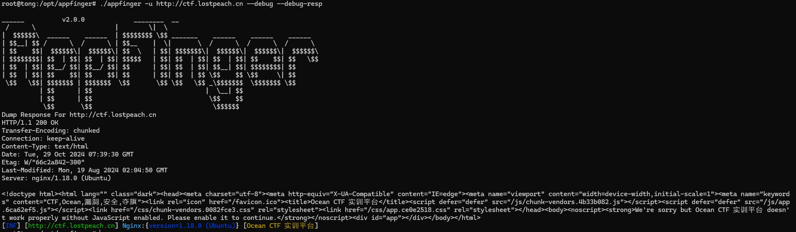

# 🔍 AppFinger

*English | [中文](README_CN.md)*

A comprehensive protocol fingerprint rule matching library for application identification.

### 📚 **Fingerprint Rules Repository**: [finger-rules](https://github.com/tongchengbin/finger-rules) - The rule definitions used by AppFinger

## ⚙️ Usage

```
Flags:
APPFINGER:
-l, -url-file string     File containing URLs to scan
-u, -url string[]        Target URL to scan (-u INPUT1 -u INPUT2)
-t, -threads int         Number of concurrent threads (default 10)
-timeout int             Timeout in seconds (default 10)
-x, -proxy string        HTTP proxy to use for requests (e.g. http://127.0.0.1:7890)
-s, -stdin               Read URLs from stdin
-d, -finger-home string  Finger YAML directory home (default is built-in)

HELP:
-debug                   Enable debug mode

OUTPUT:
-o, -output string       File to write output to
```

## 💻 Example

```
appfinger -u https://example.com
```

## 🔌 How it Works

AppFinger scans web applications by analyzing their unique fingerprints, providing valuable insights into the technologies used.

- Deep Detection Comparison


*Figure: Comparison of standard detection vs deep detection*

## 👥 Contributing

Feel free to contribute to AppFinger by opening issues or submitting pull requests on GitHub.

## 🔐 License

AppFinger is licensed under the MIT License. See the LICENSE file for details.
